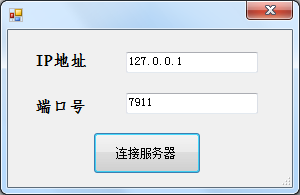
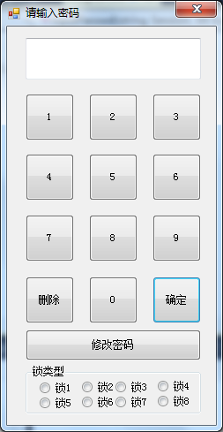
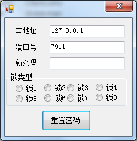
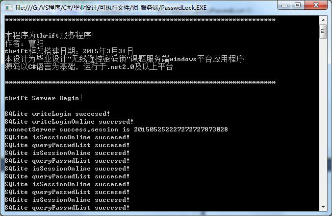
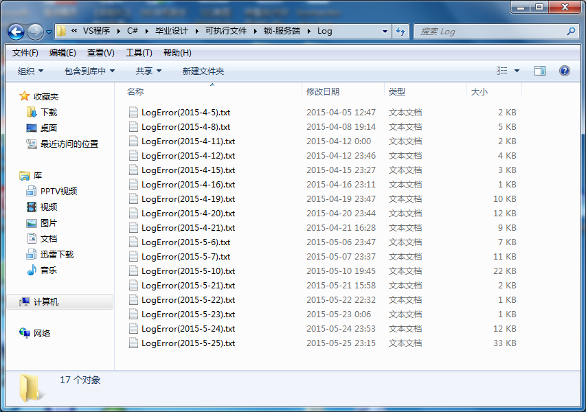

thrift是一个软件框架，用来进行可扩展且跨语言的服务的开发。它结合了功能强大的软件堆栈和代码生成引擎，以构建在 C++, Java, Python, PHP, Ruby, Erlang, Perl, Haskell, C#, Cocoa, JavaScript, Node.js, Smalltalk, and OCaml 这些编程语言间无缝结合的、高效的服务。

[百度百科Thrift介绍](http://baike.baidu.com/link?url=OLDN2uZThldjMHCXQhPk8XGPKVyFeBjcjoev8bpKQtlQs-e70K-D0vv7jEa1d5ujIfO3Z9JrezZlrNaLr0Umpa)

该系统主要分服务端以及客户端两部分组成，服务端用c＃语言实现，由业务系统、数据库系统、日志系统等组成，客户端提供c＃编写的windows客户端以及java编码的安卓客户端。

直接上图吧。

登录界面

 

客户端1

 

客户端2

 

客户端3

 

服务端

 

日志系统

 

数据库系统（Sqlite）

 

安卓客户端

 